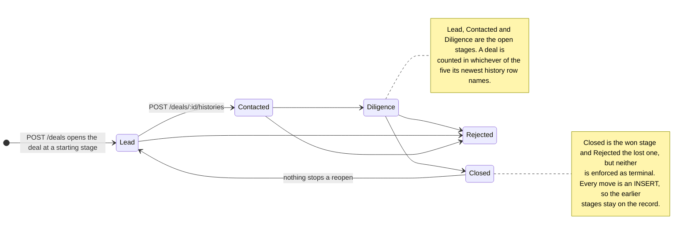
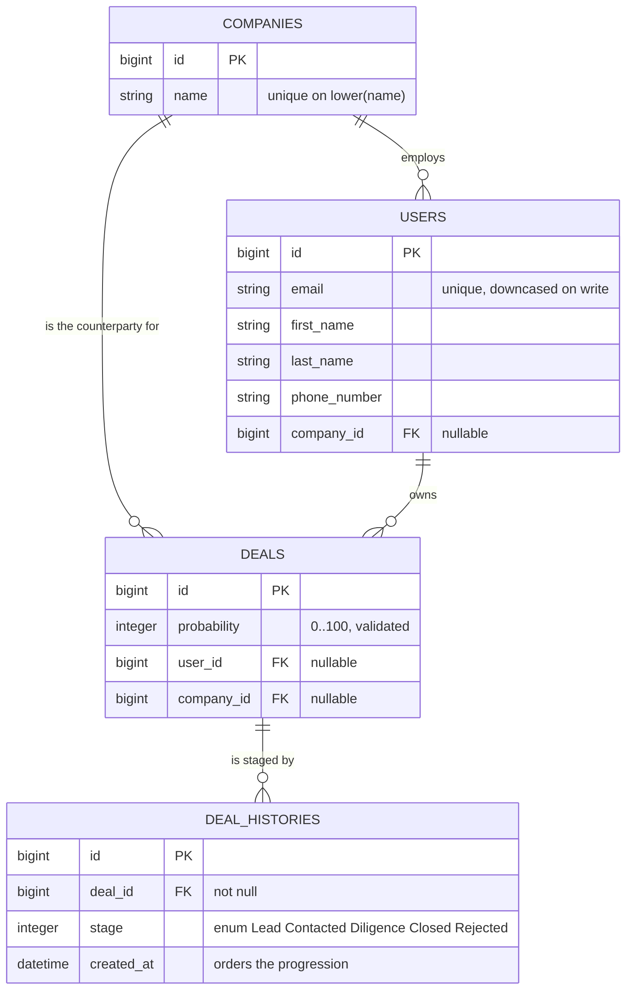

# CRM Funnel

A Rails app that turns a flat contact export into a sales pipeline. A deal has no
stage column: its position is the stage of its newest `deal_histories` row, so the
funnel is a view over what actually happened rather than a mutable status field.

It ships with the export it was built around — `crm_data.csv`, 1,000 rows, one stage
per row, 900 distinct e-mail addresses.


Every deal is counted once, in one stage, and the five stage counts sum to the deal
count. The tiles are derived: open is the three non-terminal stages, *expected to
close* is the sum of open probabilities ÷ 100, and the win rate is won ÷ (won + lost)
so it does not sag just because the pipeline is growing.

## The five stages, and what moving between them means



Opening a deal is two writes that have to land together — the deal row and its first
stage entry, because a deal with no history has no position in the funnel — so
`Crm::DealOpener` commits both in one transaction. After that, `HistoriesController`
only ever appends: there is no update and no destroy, and a mistake is corrected by
recording the correct stage on top.

Reading the current stage back is the part that costs something. `Deal.with_current_stage`
attaches it with one `LEFT JOIN LATERAL` over `deal_histories` ordered by
`created_at DESC, id DESC`, rather than a `deal_histories.last` per row — which also
means a history row inserted out of order still reports correctly.


That deal was walked Lead → Contacted → Diligence through the form while the
screenshots were being taken, and a second one was moved Contacted → Diligence,
which is why the dashboard above shows 154 deals in Diligence where a freshly
imported database has 152.

## Importing the export

```
$ bin/rails db:seed
Imported /path/to/crm-funnel/crm_data.csv
  read 1000 rows -> 900 new contacts, 162 new companies, 900 new deals,
  900 stage entries (100 duplicate rows merged, 21 probabilities clamped, 0 rows rejected)
```

The interesting number is 900 deals from 1,000 rows. 100 e-mail addresses appear
twice in the export, and **e-mail alone is the contact's natural key** — a repeated
address is the same person, not a second deal, even when the second row leaves
`company` blank. `Crm::Import::Contact.merge` takes the first non-blank value of each
field across a contact's rows and the last probability.

Repeated rows collapse only when the stage is unchanged: `Lead, Lead` becomes one
history entry, `Lead, Contacted` stays two. In this particular export every repeated
address repeats its stage, which is why the import writes exactly 900 stage entries
for 900 deals.

Everything else the importer does is visible in that one output line:

- **Probabilities above 100** — 21 rows in the bundle — are clamped to 100 and
  counted, not silently fixed.
- **Unusable rows** (blank or malformed e-mail, missing name, unrecognised stage) are
  rejected with a reason and the run continues. `db:seed` prints the first ten.
- **A missing column** is different: `CsvSource` raises `MissingHeadersError` rather
  than importing nothing in silence.
- **Re-running imports nothing new.** `Contact#stages_after` diffs the file's stages
  against what the deal already recorded, so a second `db:seed` is a no-op and a
  source that has moved a deal forward appends only the new stage.

`Crm::ContactImport` never sees a CSV. It depends on a source object with `#each_row`
yielding `Crm::Import::ContactRow`, so a Hubspot or S3-backed source is one new class
and nothing else — the merge rule, normalisation, batching and idempotency are all
independent of where rows come from.

## The tables



`User` is a CRM *contact*, not an account — the name comes from the original schema.
Deleting a company or a contact nullifies the foreign key rather than cascading, so
funnel history survives the deletion of either side.

Three index choices follow directly from the diagram:
`index_deal_histories_on_deal_and_recency` `(deal_id, created_at, id)` serves the
latest-history lookup the LATERAL join performs per deal; a descending
`(created_at, id)` index on deals, users and companies serves the newest-first order
every index page uses; and the unique index on `lower(companies.name)` makes the
import's natural key a real constraint instead of a convention.

## Counting deals, not history rows

The obvious pipeline report groups `deal_histories` by stage. That counts a deal once
per stage it has *ever* been in, so a deal that moved twice appears three times and the
stage totals exceed the number of deals. `Crm::FunnelReport` resolves each deal's
latest history row first and aggregates that, so the counts always sum to the deal
count. A spec builds a pipeline of 6 deals with 8 history rows between them and
asserts the report still totals 6 (`spec/queries/crm/funnel_report_spec.rb`, "totals to
the number of deals, not the number of history rows").

Deals with no history at all are reported as their own figure instead of being folded
into Lead, and an empty pipeline returns zeroes rather than dividing by zero.

## Query budget

Measured here by counting `sql.active_record` notifications on the bundled 1,000-row
dataset:

| | queries |
| --- | --- |
| Import all 1,000 rows | 8 |
| Deals index, loading one page of 20 | 3 |
| Whole funnel dashboard report | 1 |

Those are the queries that fetch data. A rendered `GET /deals` adds Kaminari's
count and an `exists?` check on top of the three, so the whole request is five.

The import is four preloaded lookups and four batched `insert_all`/`upsert_all` calls
in a single transaction; `ContactRow` validates every row before it goes anywhere near
the database, which is what makes bypassing ActiveRecord validations safe. Two named
specs keep this from drifting: `'stays flat instead of growing with the number of
rows'` caps a 50-row import at fewer than 15 queries, and `'resolves every deal stage
without a query per row'` asserts exactly 1.

Deals, contacts and companies all paginate (20, 25 and 25 per page), and the
dashboard's activity list is capped at 8 rows, so no page grows with the table.


Each row's badge is the stage the LATERAL join returned — 900 deals over 45 pages,
still three queries to load them.

## Running it locally

Ruby 3.1.3 and a PostgreSQL server are the only prerequisites.

```bash
bundle install
cp .env.example .env      # adjust PGUSER / PGPASSWORD for your machine
bin/rails db:prepare      # create and load schema
bin/rails db:seed         # import crm_data.csv
bin/rails server          # http://localhost:3000
```

`GET /up` is a health probe that executes a query, so a process that cannot reach
Postgres reports `503` instead of accepting traffic it cannot serve.

With Docker, `docker compose up --build` puts the app on port 8630 and Postgres on
8631 (deliberately off 3000 and 5432 so they cannot collide with local services).
Be aware of what has and has not been checked: `docker compose config` parses, but the
image has never been built or booted here — the uplift log for this repo records
`Build verified: NOT RUN — deferred, Docker off` and the same for boot. The Dockerfile
is multi-stage, runs as a non-root user and healthchecks `/up`, but treat it as
unproven until you build it.

## Configuration

Everything is environment variables and nothing secret is committed. `dotenv-rails`
loads a local `.env` if there is one.

| Variable | Default | Notes |
| --- | --- | --- |
| `PGHOST` / `PGPORT` | `localhost` / `5432` | Standard libpq variables. |
| `PGUSER` / `PGPASSWORD` | libpq defaults | One config serves a local install, Compose and a managed database. |
| `PGDATABASE` | `crm_funnel_development`, `crm_funnel_production` in production | |
| `PGDATABASE_TEST` | `crm_funnel_test` | Used by the suite. |
| `RAILS_MAX_THREADS` | `5` | Puma threads and the ActiveRecord pool. |
| `PORT` | `3000` | Port Puma binds. |
| `SECRET_KEY_BASE` | none — **required in production** | `bin/rails secret`. |
| `RAILS_SERVE_STATIC_FILES` | unset | Set to anything to serve `public/`. The image sets it. |
| `RAILS_LOG_TO_STDOUT` | unset | Log to stdout instead of `log/`. The image sets it. |
| `CRM_IMPORT_CSV` | `crm_data.csv` | Which export `db:seed` loads. |

## Working on it

```bash
bundle exec rspec           # 109 examples, 0 failures
bundle exec rubocop         # 73 files inspected, no offenses detected
bundle exec rspec spec/services spec/queries    # just the import and the funnel arithmetic
CRM_IMPORT_CSV=other.csv bin/rails db:seed
```

Both results are from the last run in this checkout. The specs in `spec/requests/`
render views for real, which is what catches a template error a controller spec would
sail past.

Where the work is: `app/services/crm/` (the import, and `deal_opener.rb`),
`app/queries/crm/funnel_report.rb` (the pipeline aggregation),
`app/models/deal.rb` (`with_current_stage`, `for_index`) and
`app/models/deal_history.rb` (the stage enum and its validation). Controllers are
thin — params in, one service or scope, a template out. `db/seeds.rb` is eight lines
that call the importer. Styling is hand-written SCSS with no framework.

## What it deliberately does not do

- **No authentication.** Every visitor can see and change everything. `User` models a
  contact, not a login.
- **No stage-transition rules.** Any stage can follow any other, including reopening a
  Closed deal. The model records what happened rather than policing it — a transition
  policy would sit next to `Crm::DealOpener`.
- **No monetary amounts.** Deals carry a probability, not a value, so "expected to
  close" is a count of deals and not forecast revenue.
- **Synchronous import.** A thousand rows is fast enough to run inline. A file big
  enough to matter belongs in a background job.
- **Probabilities above 100 are clamped, not rejected.** Reported on every run rather
  than hidden, but it is a product decision someone should confirm.
- **English only, and no soft deletes.** Flash messages and labels are literals, and a
  deleted contact or company is gone even though their deals survive.

