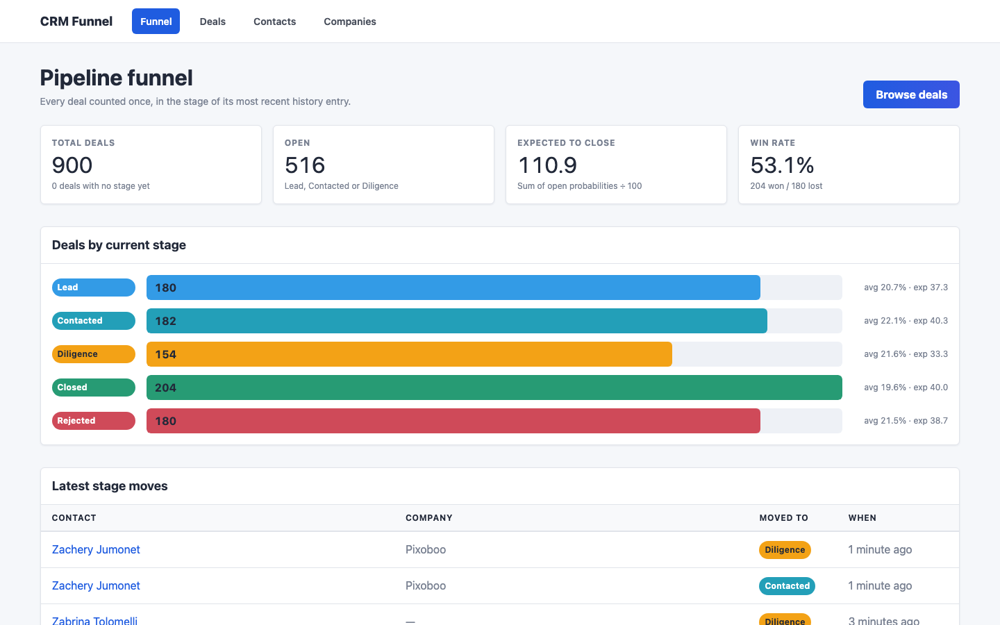
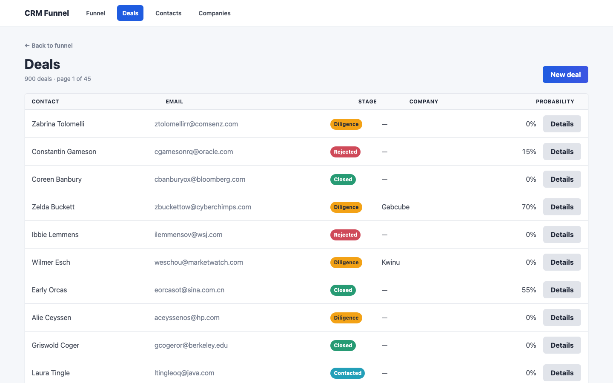
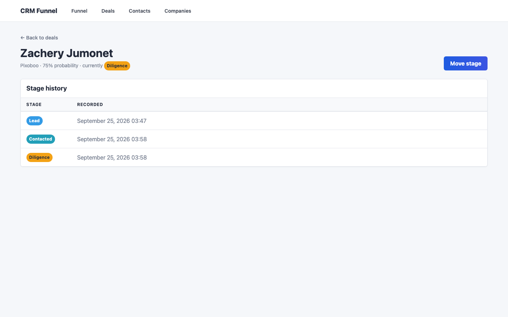
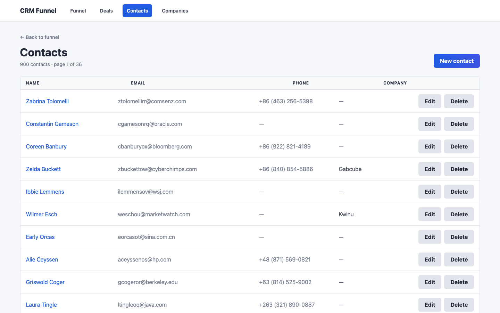
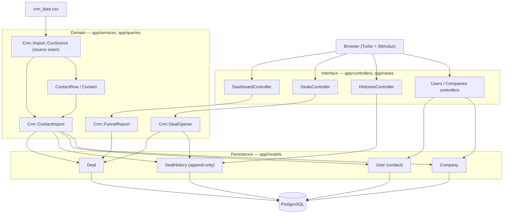
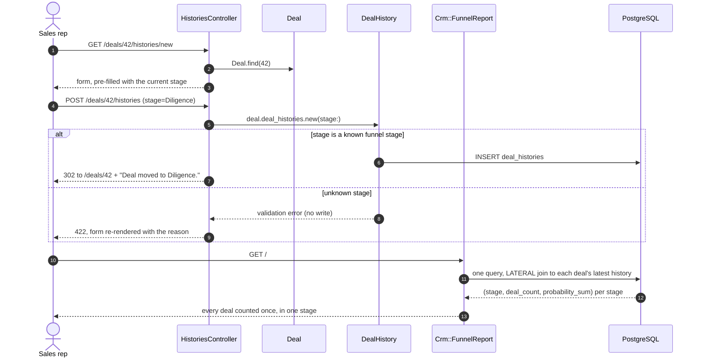

# CRM Funnel

A Rails application that turns a flat contact export into a sales funnel. It
imports contacts, companies and deals from a CSV, records every stage a deal
passes through as an append-only history, and reports the pipeline by each
deal's *current* stage.

The dataset it ships with (`crm_data.csv`, 1,000 rows) is a contact export with
one stage per row; the importer merges repeated contacts, keeps genuine stage
progressions and rejects rows it cannot trust.

## Screenshots

Captured with Playwright at 1440x900 against the app running locally on the
seeded dataset (900 deals across 162 companies).

| Funnel dashboard | Deals |
| --- | --- |
|  |  |

| Stage history for one deal | Contacts |
| --- | --- |
|  |  |

## Architecture



Dependencies point inward: controllers know about services, services know about
models, models know nothing above them. `Crm::ContactImport` depends only on a
source responding to `#each_row`, never on CSV itself.

## How a deal moves through the funnel



Nothing is ever overwritten: the deal's earlier stages stay in the table, so the
funnel is a view over history rather than a mutable status column.

## Quickstart

```bash
# Ruby 3.1.3 and a PostgreSQL server are the only prerequisites.
bundle install
cp .env.example .env          # adjust PGUSER / PGPASSWORD for your machine
bin/rails db:prepare          # create + load schema
bin/rails db:seed             # import crm_data.csv (~0.15s, 8 queries)
bin/rails server              # http://localhost:3000
```

With Docker:

```bash
docker compose up --build     # app on http://localhost:8630, Postgres on 8631
```

## Configuration

All configuration is environment variables; nothing secret is committed.
`dotenv-rails` loads `.env` in development and test.

| Variable | Required | Default | Purpose |
| --- | --- | --- | --- |
| `PGHOST` | no | `localhost` | Database host. |
| `PGPORT` | no | `5432` | Database port. |
| `PGUSER` | no | *(libpq default: your OS user)* | Database user. |
| `PGPASSWORD` | no | *(none)* | Database password. |
| `PGDATABASE` | no | `crm_funnel_development` (dev), `crm_funnel_production` (prod) | Database name. |
| `PGDATABASE_TEST` | no | `crm_funnel_test` | Database name used by the test suite. |
| `RAILS_MAX_THREADS` | no | `5` | Puma threads and the ActiveRecord pool size. |
| `PORT` | no | `3000` | Port Puma binds to. |
| `SECRET_KEY_BASE` | **yes in production** | *(none)* | Signs cookies. Generate with `bin/rails secret`. |
| `RAILS_SERVE_STATIC_FILES` | no | unset | Set to any value to let Rails serve `public/`. The Docker image sets it. |
| `RAILS_LOG_TO_STDOUT` | no | unset | Log to stdout instead of `log/`. The Docker image sets it. |
| `CRM_IMPORT_CSV` | no | `crm_data.csv` | Path to the export loaded by `db:seed`. |

## Development

```bash
bundle exec rspec                     # 109 examples
bundle exec rubocop                   # rubocop + rubocop-rails + rubocop-rspec
bundle exec rspec spec/services       # just the import
bin/rails db:seed                     # idempotent: re-running imports nothing new
CRM_IMPORT_CSV=other.csv bin/rails db:seed
```

`GET /up` is a health probe that checks the database and is what the container
healthcheck calls.

## Project structure

```
app/
  controllers/        Thin: params in, a service or a scope, a template out.
    health_controller.rb    /up probe used by the Docker healthcheck.
  models/             Records and their scopes. Deal#current_deal_stage,
                      Deal.with_current_stage, DealHistory.latest_moves.
  queries/crm/
    funnel_report.rb  Pipeline aggregation. One query, every deal counted once.
  services/crm/
    contact_import.rb Orchestrates a whole import in one transaction.
    deal_opener.rb    Deal + its opening stage entry, committed together.
    import/
      csv_source.rb   The seam: anything with #each_row can feed the import.
      contact_row.rb  One inbound row, normalised and validated on its own.
      contact.rb      All rows for one e-mail, merged into one contact.
      result.rb       What an import did, returned rather than logged.
  views/              ERB + simple_form. No business logic.
  assets/stylesheets/ Hand-written SCSS, BEM-ish, no framework.
db/
  migrate/            Schema, including the funnel's supporting indexes.
  seeds.rb            Ten lines: it just calls the importer.
spec/
  requests/           Render views for real; these catch template errors.
  services/, queries/ Import and funnel arithmetic.
  models/, controllers/
docs/screenshots/     Images referenced by this README.
crm_data.csv          The bundled 1,000-row contact export.
```

## Design notes

**The funnel is derived, never stored.** A deal has no `stage` column. Its
position is the stage of its most recent `deal_histories` row, so a deal that
moved Lead → Contacted → Diligence still has all three, and the funnel is
reproducible for any point in time. The cost is that "current stage" is a
per-deal lookup, which is why it is a `LATERAL` join rather than a Ruby-side
`deal_histories.last`.

**Counting deals, not history rows.** The obvious pipeline report groups
`deal_histories` by stage. That counts the same deal once per stage it has ever
been in — a deal that has moved twice is counted three times and the totals
exceed the number of deals. `Crm::FunnelReport` resolves each deal's latest
history row first, then aggregates, so the stage counts always sum to the deal
count. This is asserted directly in `spec/queries/crm/funnel_report_spec.rb`.

**Where the time actually went.** Two measured bottlenecks, both fixed:

| | before | after |
| --- | --- | --- |
| Import 1,000 CSV rows | 8,240 queries, 5.46s | 8 queries, 0.15s |
| Deals index, one page of 20 | 41 queries | 3 queries |

The import was row-at-a-time `find_or_create_by!`, roughly three round trips per
line. It is now four preloaded lookups and four batched `insert_all`/`upsert_all`
calls inside one transaction; `Crm::Import::ContactRow` validates every row
before it reaches the database, which is what makes skipping ActiveRecord
validations safe here. The deals index issued one query per deal for the user,
the company and the stage; it now uses `Deal.for_index` (`includes` plus the
`LATERAL` join) and is flat in the page size. Both figures come from counting
`sql.active_record` notifications, and both are pinned by specs so they cannot
silently regress.

**Indexes match the access patterns.** `index_deal_histories_on_deal_and_recency`
(`deal_id, created_at, id`) serves the latest-history lookup; `*_on_recency`
indexes serve the "newest first" ordering every index page uses;
`index_companies_on_lower_name` makes the import's natural key a real constraint
instead of a convention.

**Everything is paginated.** Deals, contacts and companies all use Kaminari, and
the dashboard's activity list is `LIMIT`-ed. No page can grow unbounded with the
table.

**No `default_scope`.** The models used `default_scope { order(created_at: :desc) }`,
which silently orders every join, subquery and `pluck`. Ordering is now an
explicit `.recent` scope applied where it is wanted.

**The one extension seam.** `Crm::ContactImport` depends on a source object with
`#each_row` yielding `Crm::Import::ContactRow`. `CsvSource` is one
implementation; a `HubspotSource` or an S3-backed source is a new class and
nothing else. The import's merge, validation, batching and idempotency logic is
independent of where rows come from.

**Errors are reported, not swallowed.** The old import called `user.save` and
ignored the result, so a bad row quietly produced a deal with no contact. Rows
are now validated up front and an import returns a `Result` listing rejections
and how many probabilities were clamped, which `db:seed` prints.

## Limitations

- **No authentication or authorisation.** Every visitor is effectively an admin.
  `User` models a CRM *contact*, not an account.
- **No stage-transition rules.** Any stage can follow any other, including
  reopening a Closed deal. The model records what happened rather than policing
  it; a transition policy would slot in next to `Crm::DealOpener`.
- **Deals have no monetary amount.** The schema stores a probability, not a
  value, so "expected to close" is a count of deals, not forecast revenue.
- **The import is synchronous.** A thousand rows take about 0.15s, so it runs
  inline. A file large enough to matter belongs in a background job.
- **Probabilities above 100 are clamped, not rejected.** The bundled export has
  21 such rows. The count is reported on every import rather than hidden.
- **Single locale, no i18n.** Flash messages and labels are English literals.
- **No soft deletes.** Deleting a company or contact detaches their deals
  (`dependent: :nullify`) so funnel history survives, but the record is gone.
